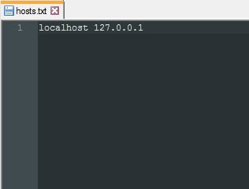
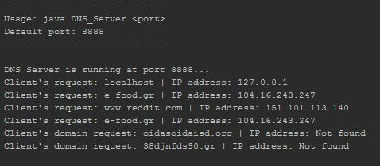

# DNS-Server
A simple DNS server that gets a hostname from a client and returns the hostname's IP address.

Basically, this simplistic DNS server has as point of reference a text file called `hosts.txt` where each line has a hostname and its IP address separated with one space (initialized only with **localhost**):

When the client sends a UDP packet with a hostname, the server looks up `hosts.txt` and if it fails to find the address of the given hostname, it searches it on the internet with `java.net.InetAddress.getByName()` and puts the found address along with the hostname in `hosts.txt`. If the hostname doesn't seem to exist, it sends "-1" back to the client.

### Execution
* `java DNS_Server <port_number (default: 8888)>`
* `java DNS_Server`

### Output example

Tied with sister project [DNS-Client](https://github.com/Coursal/DNS-Client).

Tested on NetBeans 8.2.
